

  <picture>
    <source media="(prefers-color-scheme: dark)" srcset="docs/brand/plankton-logo-dark.svg">
    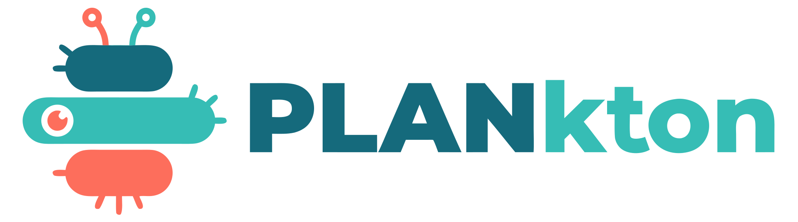
  </picture>

<b>Plan your project in one file: tasks, a Gantt chart and a board, right in your browser. No sign-up, no install, works offline.</b>

  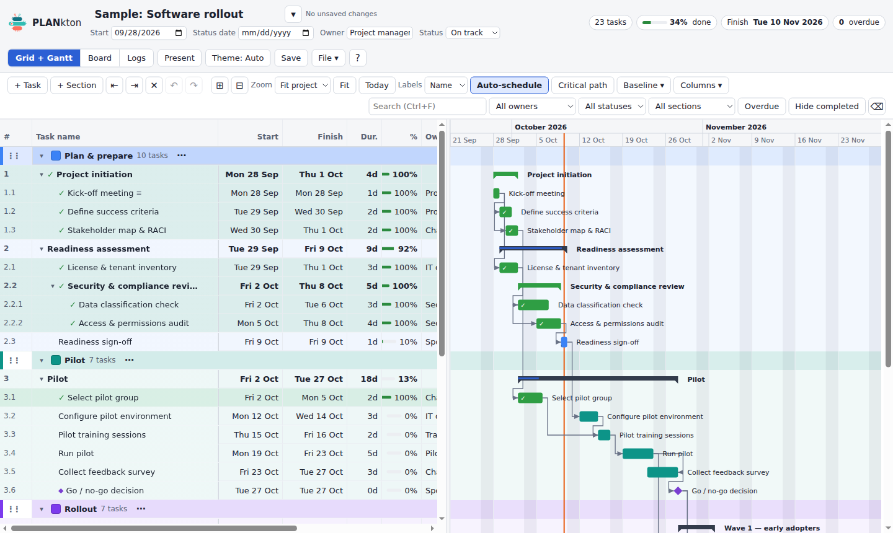

<h2 align="center">
  <a href="https://github.com/bioztar/plankton/raw/main/dist/plankton.html">⬇ Download PLANkton</a>
</h2>

One file, about 450 KB. If your browser shows a page full of code instead of downloading, go back, right-click the link and choose <b>Save link as…</b>

---

## Get started in 2 minutes

1. **Download** [`plankton.html`](https://github.com/bioztar/plankton/raw/main/dist/plankton.html) and put it somewhere you will find it again (Documents, a OneDrive folder, a shared drive).
2. **Double-click it.** It opens in your web browser and shows a sample plan, *Software rollout*, so you can look around.
3. **Start your own plan:** **File › New plan…**, type a name. You can rename it any time by clicking the plan name at the top left (or **File › Rename plan…**).
4. **Add tasks:** click **+ Task** (or press Insert), type the name, press Enter. Double-click any cell to change dates, duration, owner or status.
5. **Save:** click **Save** (or press Ctrl+S, ⌘+S on a Mac). Your plan is stored *inside the .html file itself*.
   - **Chrome and Edge:** the first time you save a file, PLANkton asks you to pick that same file once, so the browser lets it write to it. After that, Save just saves.
   - **Safari and Firefox:** these browsers cannot write to files, so Save downloads an updated copy of the file. Replace your old file with the downloaded one.

Every Save also adds a **version** you can go back to (see [Version history](#version-history)).

> Tip: one file can hold one plan you share, but you can keep as many plans as you like in your browser: use the **▾** next to the plan name to switch between them.

## Everyday use

### Edit like a spreadsheet

Click a cell to select it, double-click (or just start typing) to edit. Drag across cells, or hold Shift and use the arrow keys, to select a block.

- **Copy and paste** with Ctrl+C / Ctrl+V, also to and from Excel or Google Sheets. One copied value pasted onto a selection fills all of it.
- **Fill down** with Ctrl+D, or drag the small square at the bottom-right of the selection.
- **Delete** clears the selected cells. **Undo** (Ctrl+Z) takes back any change, a whole paste at once.
- **Move a task** by dragging its number in the **#** column. Drop it onto the middle of another task to make it a subtask, or press **Tab** / **Shift+Tab** to indent and outdent.
- **Choose a status or priority** with one click on the cell.

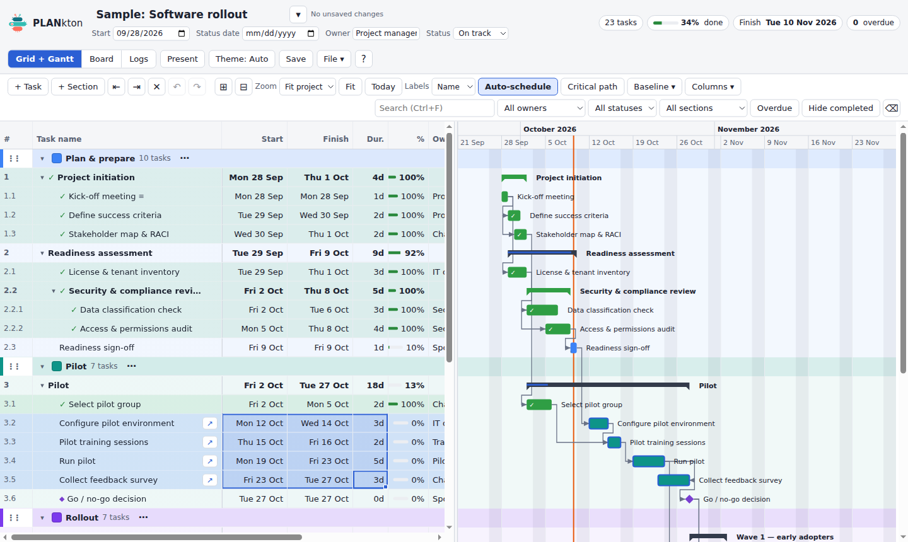

### Task details

Hover a task and click **↗** (or press Enter on its name) to open the details panel: dates, progress, owner, tags, a description with headings, lists, checklists and links (paste from Word or Outlook keeps the formatting), notes, and the tasks it depends on.

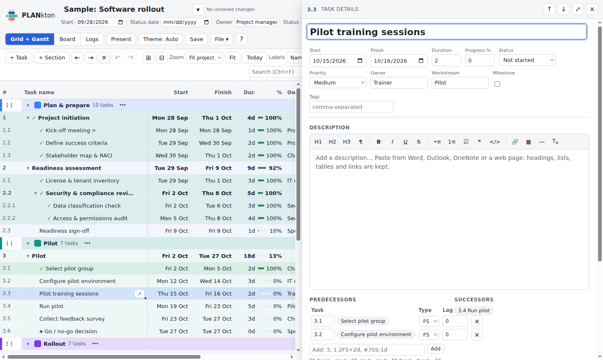

### Sections

Sections are coloured header rows that group tasks, such as *Plan & prepare* or *Pilot*. Add one with **+ Section**. The **⋯** button on a section lets you rename it, change its colour, add tasks to it or move it up and down with all its tasks.

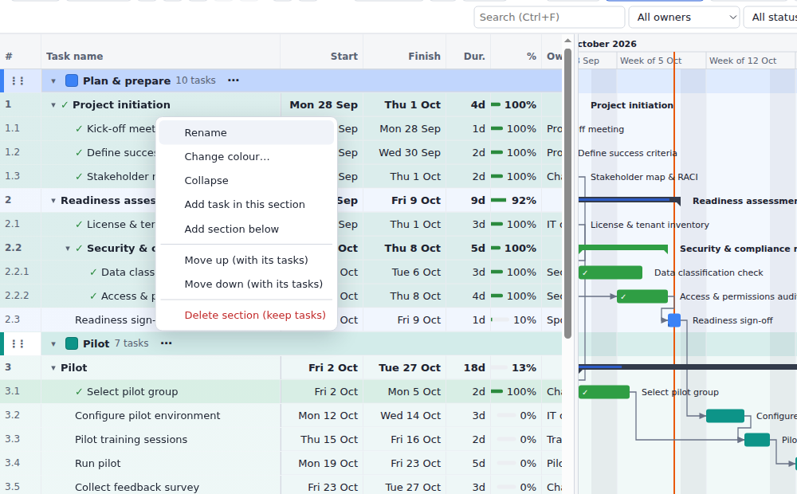

### Dependencies

A dependency says “this task can only start when that one is done”. In the task details, type the number of the task it waits for under **Predecessors** (for example `3.1`), or in the Gantt drag the small circle at the end of one bar onto another bar.

Other kinds are possible too: *start together* (`3.1SS`), *finish together* (`3.1FF`), and a gap or overlap in working days (`3.1FS+2d`, `3.1FS-1d`). With **Auto-schedule** on, moving a task moves everything that depends on it.

### Gantt chart

The right half of **Grid + Gantt** shows every task as a bar on a calendar.

- Drag a bar to move the task, drag its right edge to make it longer or shorter.
- **Zoom** by day, week, month or quarter, or **Fit** to see the whole project. **Today** jumps to today's date (the orange line).
- **Critical path** highlights the chain of tasks that decides your finish date.
- **Baseline** saves today's dates so you can later see how far the plan has moved.

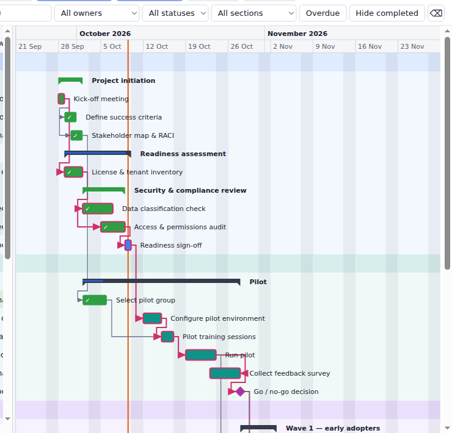

### Board

**Board** shows your tasks as cards in columns by status. Drag a card to another column to change its status.

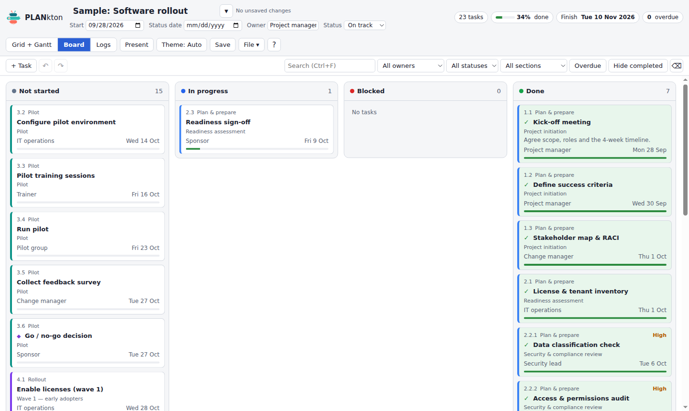

### Logs

**Logs** keeps the lists every project needs next to the plan: **risks** (impact, likelihood, mitigation), **decisions** (who decided and when) and **open questions**.

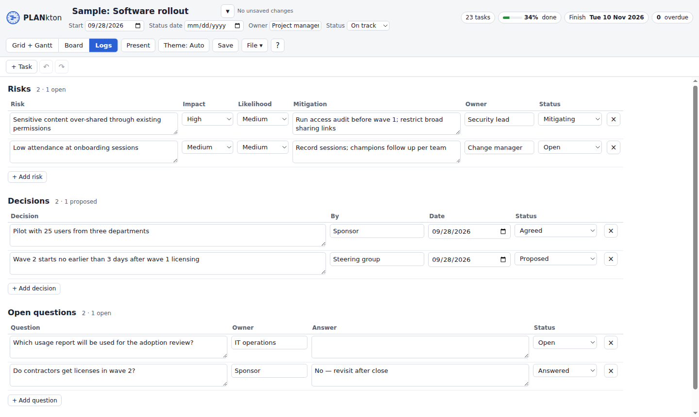

### Status and priority options

The choices in the Status and Priority columns belong to your plan. Open **File › Status options…** (or right-click the column header › **Edit options…**) to add, rename, recolour, reorder or remove them, and to tick which statuses count as **complete**. Complete tasks get a green ✓ and **Hide completed** filters them out.

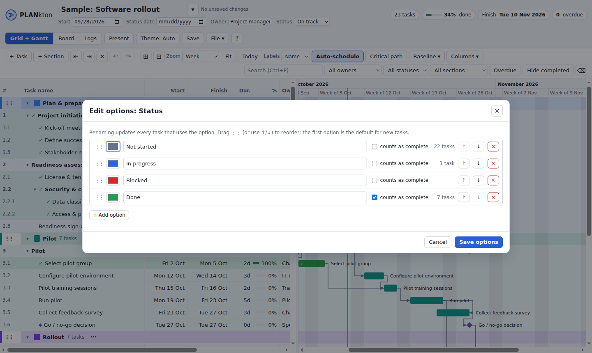

### Version history

Every Save adds a version inside the file, with the time, your name (asked once) and a short list of what changed. **File › Version history…** lists them: **Preview** one, **Restore** it (you can undo that too), or export it. The file keeps the last 50 versions.

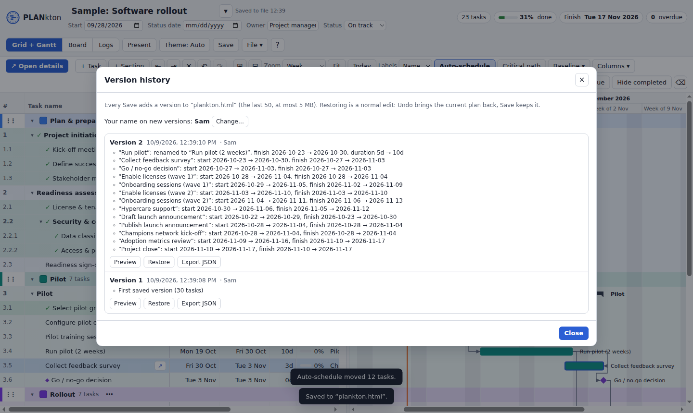

### Sharing a plan

A plan is just a file, so share it like any document:

- **Send the .html file** by email or chat, or put it in a shared folder (OneDrive, Teams, SharePoint, Google Drive). Anyone can open it in their browser and edit it; nothing to install.
- **Working together on one file:** open the copy in the shared folder from your synced folder in Chrome or Edge, edit, and Save. If someone else saved it since you opened it, PLANkton asks before overwriting.
- **Read-only copy:** **File › Export read-only presenter copy (.html)** makes a version others can view but not change.
- **Presenting in a meeting:** **Present** hides the editing tools and makes the text larger.

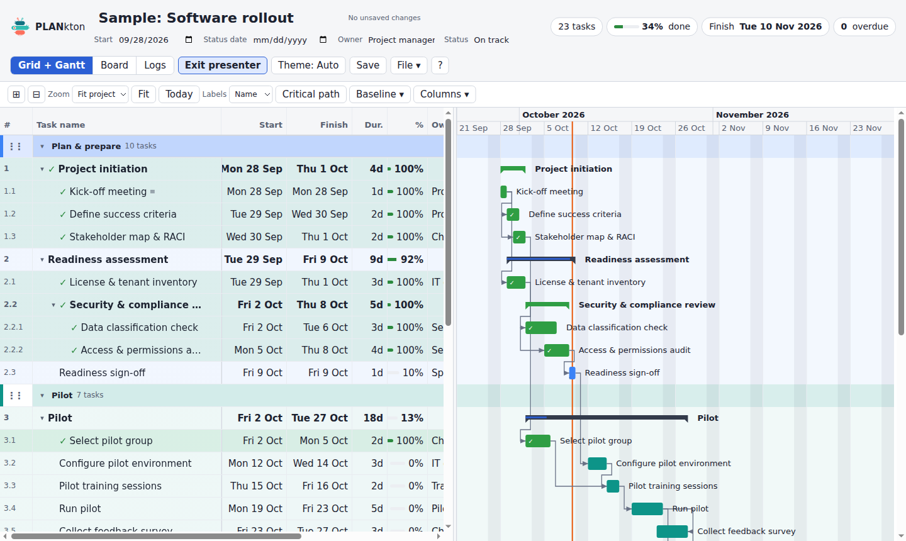

You can also **print** (Ctrl+P), save the Gantt as a picture (**File › Export Gantt as PNG**), or export to a spreadsheet (**File › Export CSV**).

## Keyboard shortcuts

On a Mac use ⌘ instead of Ctrl. Press **?** in PLANkton for the full list.

| Keys | What it does |
| --- | --- |
| Arrow keys | Move between cells (with Shift: select a block) |
| Double-click, F2 or just type | Edit the cell |
| Enter on a task name | Open the task details |
| Esc | Cancel editing / close the details panel |
| Ctrl+C / Ctrl+V / Ctrl+X | Copy / paste / cut cells |
| Ctrl+D | Fill down |
| Delete | Clear the selected cells |
| Tab / Shift+Tab | Indent / outdent (make or undo a subtask) |
| Insert or Ctrl+Enter | New task below (Shift+Insert: new section) |
| Alt+Shift+↑ / ↓ | Move rows up / down |
| Ctrl+Z / Ctrl+Shift+Z | Undo / redo |
| Ctrl+F | Search |
| Ctrl+S | Save |
| Ctrl+Shift+S | Save as a new file |
| Ctrl+P | Print |
| ? | Shortcuts and help |

## Privacy

- **Works offline.** After you download it, PLANkton never needs the internet.
- **No data leaves your computer.** Your plan lives in the .html file and, as a safety net, in your browser's own storage on this computer. The file is locked down so it *cannot* send anything anywhere.
- **No accounts, no tracking, no ads.**

## Browser support

| Browser | Open and edit | Save | Version history |
| --- | --- | --- | --- |
| Chrome, Edge, Brave (Windows, Mac, Linux) | Yes | Saves straight into the file (pick the file once) | Yes |
| Safari (Mac) | Yes | Downloads an updated copy | Yes |
| Firefox | Yes | Downloads an updated copy | Yes |
| Phones and tablets | Not designed for small screens yet | | |

## FAQ

**Where is my data?**
In the .html file, every time you Save. Between saves, your edits are also kept in your browser on this computer, so closing the tab does not lose them (PLANkton warns you if there are unsaved changes). If you open a file and your browser has newer edits of that same plan, PLANkton shows the newer edits and offers to switch back to the file.

**How do I share a plan?**
Send the saved .html file, or put it in a shared folder. See [Sharing a plan](#sharing-a-plan).

**How do I back up a plan?**
The saved .html file *is* the backup; copy it anywhere. **File › Export JSON** gives you a small data-only file as well.

**How do I move a plan to a newer version of PLANkton?**
Your plan file contains the version of PLANkton it was saved with. To upgrade it:
1. Download the new [`plankton.html`](https://github.com/bioztar/plankton/raw/main/dist/plankton.html) and open it.
2. Drag your existing plan file onto the PLANkton window (or use **File › Import plan file (.html or .json)…**). Your plan opens with its version history.
3. **File › Save as…** and choose your old file to replace it (in Safari or Firefox, Save downloads the upgraded file: replace the old one with it).

This also works for files from **planboard**, the earlier name of PLANkton: they open and save as normal. Plans, your theme and your name saved by planboard in the same browser carry over automatically.

**Can I import from Excel, Planner or Smartsheet?**
Yes: copy the rows in the other app, then **File › Paste table (Excel, Planner, Smartsheet)…**.

**Something looks wrong after an edit.**
Press Ctrl+Z to undo, or go back to an earlier version with **File › Version history…**.

---

PLANkton is built with plain HTML, CSS and JavaScript, no dependencies. Developers: see [CONTRIBUTING.md](CONTRIBUTING.md) for how to build and test it.

Free and open source under the [MIT licence](LICENSE): use it, change it and share it.
